# Integrated Assignment Environment (IAE)


> **CE 316 — Programming Languages · Final Project · Spring 2026**
> İzmir University of Economics — Department of Computer Engineering

**Team 8:** Deniz Gürkan · Çağan Parlapan · Fatih Çelik · Can Esen · Emre Taşkın

📦 **[Latest Release: v2.0.0-m3](https://github.com/dnzgrkn/Integrated_Assignment_Environment/releases/tag/v2.0.0-m3)** — Windows installer (MSI) and self-contained JAR available as release assets.

---

## Project Overview

The **Integrated Assignment Environment (IAE)** is a desktop application that batch-evaluates programming assignments. Instead of compiling and running each student submission by hand, the grader defines a reusable language configuration once, points the application at a directory of submitted archives, and lets IAE extract, compile or interpret, execute, and grade every submission automatically — reporting the outcome of each submission with colour-coded statuses in a single results view.

IAE is **language-agnostic by design**: support for additional languages (C, Java, Python, or anything else) is added by creating a new configuration, not by changing IAE itself.

---

## System Architecture

IAE is structured as four layers with strictly downward dependencies — the user interface depends on the service engine, the service engine on the domain model, and the domain model on the persistence layer.

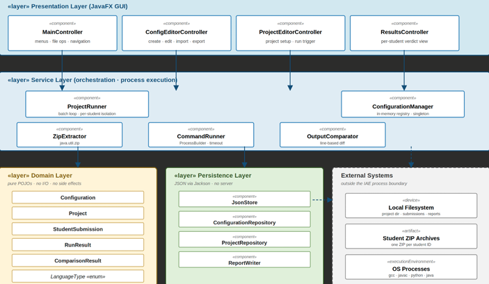

- **Presentation Layer (JavaFX)** — main window, dialogs, results table, embedded WebView for the user manual
- **Service Layer** — archive extraction, compilation/execution with timeout enforcement, output comparison, batch project runner
- **Domain Layer** — Configuration, Project, RunResult, ComparisonResult, StudentSubmission
- **Persistence Layer** — JSON-backed repositories for configurations and projects, via Jackson

The implementation uses several classical design patterns: **Singleton** for the configuration manager, **Strategy** for per-language handling, **Observer** for incremental result updates, **Repository** for storage abstraction, and **MVC** for the FXML views and controllers.

---

## Quick Start

### Option 1 — Windows Installer (recommended for graders)

Download `IAE-1.0.0.msi` from the [latest release](https://github.com/dnzgrkn/Integrated_Assignment_Environment/releases/tag/v2.0.0-m3), double-click to install, and launch IAE from the Start Menu. A trimmed Java 21 runtime is bundled, so **no manual Java setup is required**.

### Option 2 — Executable JAR

Requires Java 21 on PATH. Download `iae-1.0.0-SNAPSHOT.jar` from the release page and run:

```bash
java -jar iae-1.0.0-SNAPSHOT.jar
```

### Option 3 — Build from source

```bash
git clone https://github.com/dnzgrkn/Integrated_Assignment_Environment.git
cd Integrated_Assignment_Environment
mvn clean package
java -jar target/iae-1.0.0-SNAPSHOT.jar
```

To run in development mode without producing a JAR:

```bash
mvn javafx:run
```

To rebuild the Windows installer (requires WiX Toolset):

```bash
.\package-windows.bat
```

### Prerequisites

- **Java 21** (any standard distribution) — required for source build and JAR. The installer bundles its own runtime.
- **Apache Maven 3.9+** — only for building from source.
- **gcc / javac / python** — only the compilers or interpreters for the languages you actually evaluate need to be on PATH.

---

## Requirements Coverage

All ten project requirements are implemented and verified. Each section below explains how the requirement is satisfied, with a screenshot demonstrating the behaviour.

### R1 — Installer

> *The software must provide an installer/setup package.*

IAE is packaged as a native Windows installer (.msi) produced with the `jpackage` tool that ships with the JDK. The installer bundles a trimmed Java 21 runtime, places the application under Program Files, creates Start Menu and desktop shortcuts, and registers an uninstaller — no Java pre-installation needed.

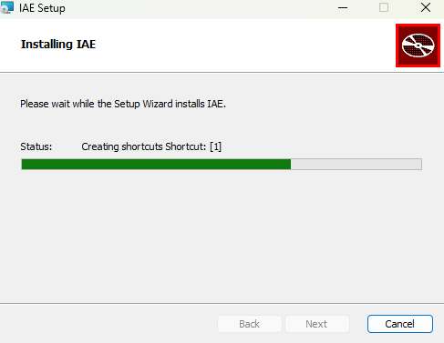

### R2 — User Manual

> *The software must provide a user manual accessible from the Help menu.*

Selecting **Help → User Manual** opens an in-application window that renders a bundled HTML manual via an embedded JavaFX WebView. The manual is divided into eight sections (introduction, getting started, managing configurations, creating projects, running an evaluation, understanding results, troubleshooting, about) with a card-based layout and colour-coded callouts matching the result-status palette. The manual is bundled as an application resource and is available offline.

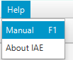
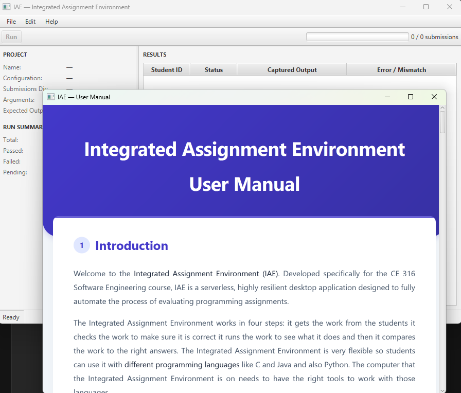

### R3 — Create a Project Using an Existing or New Configuration

> *The user must be able to create a project that uses an existing or a new configuration.*

The **Project Editor** dialog (File → New Project) provides a project name field, a configuration selector populated from all stored configurations, a submissions-directory browser, a command-line-arguments field, and an expected-output area. The user may pick a previously saved configuration (existing) or first create one in the Configuration Editor and then select it (new). The configuration is embedded in the project on save, so saved project files are self-contained and portable.

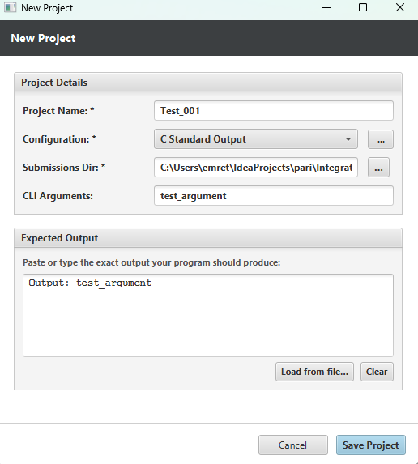

### R4 — Create, Edit, and Remove a Configuration

> *The user must be able to create, edit, and remove a configuration.*

The **Configuration Editor** (Edit → Manage Configurations) lets the user create, edit, or remove configurations. The form is organised into General (name, language type, compiled flag), Compiler (compiler path, flags), and Execution (run command, source file name) sections. Selecting a language type automatically sets the compiled flag and seeds reasonable defaults for the compiler and run commands. Each configuration is persisted as a JSON file in the application data directory.

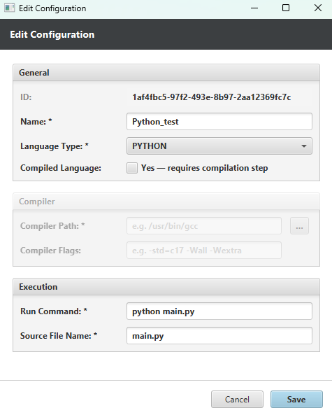
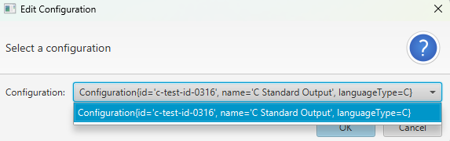

### R5 — Import and Export Configurations

> *The user must be able to import and export configurations.*

Three operations cover this requirement. **Import Configuration** (Edit menu) lets the user load a configuration JSON file from disk into the configuration library. **Export Configuration** (a button inside the Configuration Editor) writes the currently-edited configuration to a JSON file at a chosen location. **Export All Configurations** (Edit menu) writes every stored configuration into a chosen directory in one step — useful for backing up a course's full configuration set.

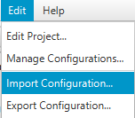
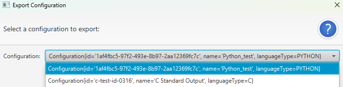

### R6 — Batch Processing of Submissions

> *The software must process multiple submissions in a single batch.*

When the user clicks **Run**, the project runner enumerates every ZIP file in the submissions directory and processes each one in its own isolated working directory. A failure in one submission — corrupt archive, compilation error, infinite loop — produces an appropriately-classified row and does not abort the batch. A progress indicator advances and a status bar reports counts as submissions complete; results stream into the table as each one finishes.

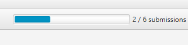

### R7 — Compile or Interpret Source Code

> *The software must compile or interpret source code using the configuration of the project.*

For a compiled language, the command runner invokes the configured compiler with the configured flags against the expected source file inside each submission's working directory (e.g., `gcc -Wall -o main main.c`). For an interpreted language, the compile step is skipped and the run command is executed directly. Compilation failures are captured with the compiler's own diagnostic output and reported as a COMPILE_ERROR row, so the grader sees exactly why the submission did not build.

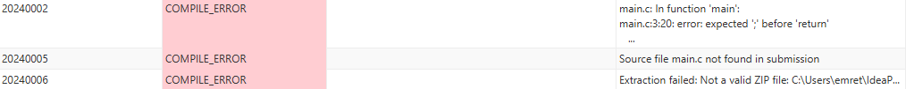

### R8 — Output Comparison

> *The software must compare the output of the student program with the expected output.*

After a submission's program runs, its captured standard output is compared with the project's expected output line by line, with trailing-whitespace and line-ending differences normalised so they do not cause spurious mismatches. A match yields **PASS**; a mismatch yields **FAIL** with the first differing line shown. A non-zero exit is reported as **RUNTIME_ERROR**, and a program that exceeds the time limit is reported as **TIMEOUT** — distinguishing wrong answers from crashes from infinite loops.

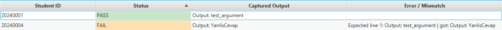

### R9 — Display Results

> *The software must display the results of each student file.*

Results are presented in a table with one row per submission, showing the submission identifier, the status, the captured output, and any error or mismatch detail. Statuses are colour-coded — green for PASS, orange for FAIL, red for COMPILE/RUNTIME/TIMEOUT errors — so the grader can scan the overall composition of a run at a glance. A summary panel tallies the totals.

The screenshot below shows the actual outcome of running IAE against the six demonstration fixtures shipped with the project. The fixtures are chosen so that every result status appears at least once.

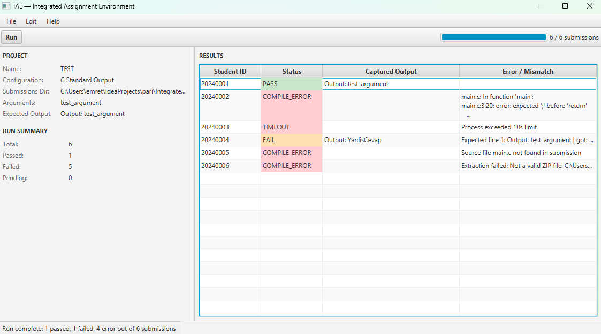

| Submission | Status | Detail |
|---|---|---|
| 20240001 | **PASS** | Output matches expected |
| 20240002 | **COMPILE_ERROR** | Missing semicolon (gcc diagnostic) |
| 20240003 | **TIMEOUT** | Exceeded 10s run limit (infinite loop) |
| 20240004 | **FAIL** | Output mismatch on first line |
| 20240005 | **COMPILE_ERROR** | Source file `main.c` not found (Java in C config) |
| 20240006 | **COMPILE_ERROR** | Not a valid ZIP file (corrupt archive) |

### R10 — Open and Save Projects

> *The user must be able to open and save projects.*

A project — including its embedded configuration and the most recent run results — can be saved to disk as a single JSON file via **File → Save Project** / **Save Project As**, and reopened later via **File → Open Project**. Reopening restores the Project panel, the run summary, and the results table exactly as they were when the project was saved, so a long grading session can be paused and resumed without losing work.

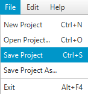

---

## Testing

The project is covered by an automated test suite written with **JUnit 5**, exercising the domain model, the persistence layer, and the service layer. Running the suite produces a clean build:

```bash
mvn test
```

```
[INFO] Tests run: 74, Failures: 0, Errors: 0, Skipped: 3
[INFO] BUILD SUCCESS
```

The three skipped tests are platform-conditional shell-based cases that are skipped on Windows via JUnit assumptions; equivalent coverage exists for Windows in the same test class.

In addition to the unit suite, an **end-to-end integration test** exercises the project runner against real external tools — `javac`/`java` for the compiled path and `python` for the interpreted path — and the full pipeline is manually verified through the GUI against the six demonstration fixtures listed under R9.

---

## Technology Stack

| Component | Technology |
|---|---|
| Language and runtime | Java 21 LTS |
| User interface | JavaFX 21 (Controls, FXML, Web) |
| Build system | Apache Maven |
| Serialisation | Jackson Databind |
| Logging | SLF4J + Logback (rolling file appender) |
| Testing | JUnit 5 |
| Installer | jpackage (JDK 21) producing Windows MSI |
| Packaging | Maven Shade Plugin (uber-JAR with JavaFX natives) |

---

## Project Management

This project followed a feature-branch Git workflow with code review on every change. All work was tracked through GitHub pull requests; each pull request was reviewed by the project lead before being merged into `master`. The team coordinated through a shared Task Point System spreadsheet and WhatsApp.

- **Repository:** [github.com/dnzgrkn/Integrated_Assignment_Environment](https://github.com/dnzgrkn/Integrated_Assignment_Environment)
- **Latest Release:** [v2.0.0-m3](https://github.com/dnzgrkn/Integrated_Assignment_Environment/releases/tag/v2.0.0-m3)

---

## Team

| Member | Primary Contributions |
|---|---|
| **Deniz Gürkan** | Project lead and architect; JavaFX GUI shell and main controller; service-integration (run pipeline wiring, background task, listener-driven UI updates, colour-coded results, progress and summary); pull-request review and merge; final integration; fat-JAR packaging; final report and documentation. |
| **Çağan Parlapan** | Service-layer engine: archive extractor (with Zip-Slip protection), command runner with timeout enforcement, output comparator with normalisation, batch project runner with per-submission error isolation, singleton configuration manager — with unit-test coverage. Configuration import/export and configuration-editor improvements. |
| **Fatih Çelik** | Domain model entities and the JSON persistence layer (with unit tests); SLF4J/Logback logging configuration with rolling file appender; end-to-end integration tests; portability work to make platform-dependent tests run on every supported OS. |
| **Can Esen** | Configuration Editor and Project Editor dialogs (FXML and controllers); Windows MSI installer script using `jpackage`; installer build automation. |
| **Emre Taşkın** | Demonstration test fixtures (six sample submissions covering every result status); user-manual HTML content with card-based layout and colour-coded callouts; project documentation. |

---

## License

Academic project — CE 316 Programming Languages, İzmir University of Economics, 2026 Spring.
